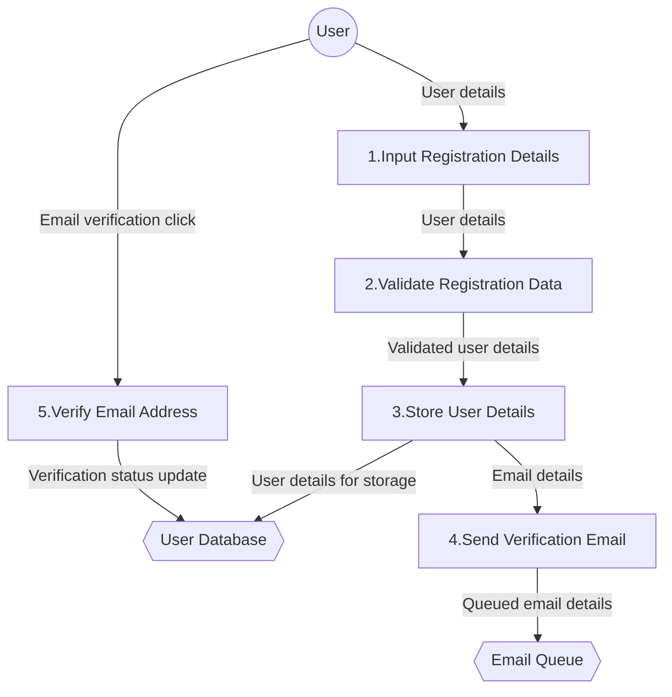

```mermaid
flowchart TD

User((User))
Details[1.Input Registration Details]
Validation[2.Validate Registration Data]
Store[3.Store User Details]
DB{{User Database}}
Email[4.Send Verification Email]
Queue{{Email Queue}}
Verify[5.Verify Email Address]

User -->|User details| Details
Details -->|User details| Validation
Validation -->|Validated user details| Store
Store -->|User details for storage| DB
Store -->|Email details| Email
Email -->|Queued email details| Queue
User -->|Email verification click| Verify
Verify -->|Verification status update| DB
```