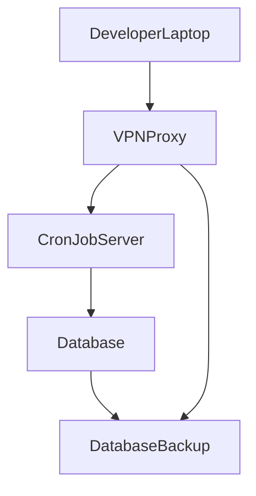
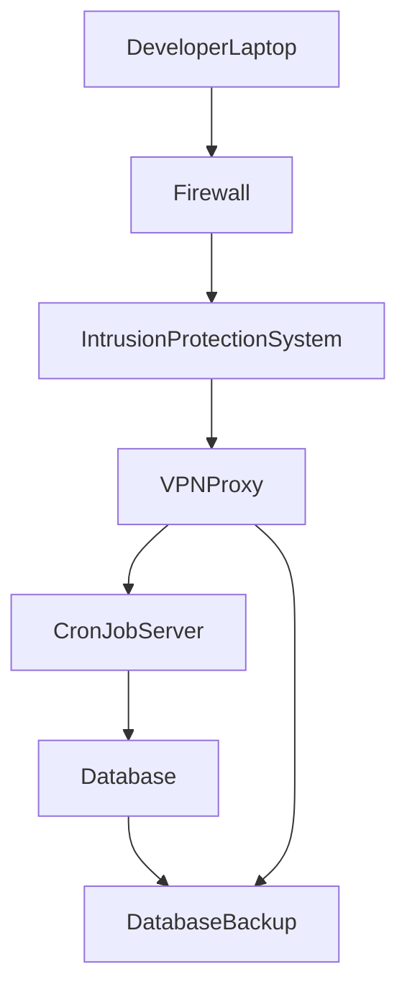
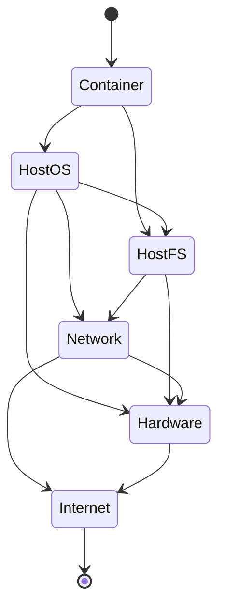

# 1 Consider below diagram represents the network architecture of a VPN controlled data intensive application

How can be improved the security of the network architecture considering a defense in depth approach?

# 2 Containers
Containers run on top of a host OS, use root as default user inside the container and are isolated from the host filesystem by default. How to secure containerized applications if they need to read and write files from the host?

How could be secured the containerized application considering a defense in depth approach?

* Restrict IPs to which the container has access
* Hardening the host OS