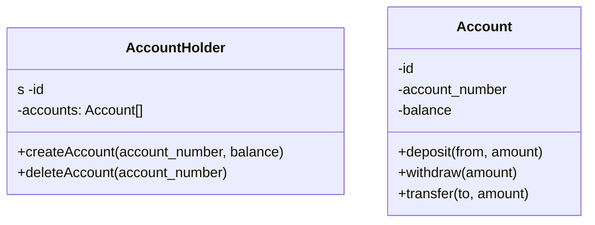

# 1 Consider a banking application managing the accounts of a user.

```mermaid
classDiagram
    class AccountHolder{
     s   -id
        -accounts: Account[]
        +createAccount(account_number, balance)
        +deleteAccount(account_number)
    }
    class Account{
        -id
        -account_number
        -balance
        +deposit(from, amount)
        +withdraw(amount)
        +transfer(to, amount)

    }
```
What should be the minimum logging required to monitor the security of the transactions?